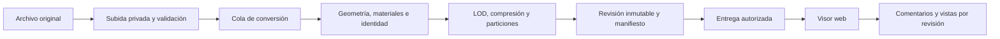

# Fabrica — arquitectura propuesta

Investigación consultada el **10 de septiembre de 2026**. Estado: propuesta técnica; no hay implementación ni benchmarks ejecutados. Las elecciones se revisarán con el protocolo de [rendimiento](rendimiento.md).

## Decisión principal

Construir un producto propio sobre tecnología gráfica existente. La inversión diferencial estará en la preparación de archivos, navegación, identidad de elementos y continuidad del feedback. Un motor gráfico desde cero solo se justificaría con un límite medido que las bibliotecas disponibles no resuelvan.

El navegador recibirá una representación preparada para visualizar. El archivo de autoría original se conservará junto con sus metadatos. Convertir una malla a GLB no conserva automáticamente toda la información BIM ni los materiales de su aplicación de origen.

## Stack candidato

| Capa | Propuesta | Motivo y condición |
|---|---|---|
| Landing | Astro + TypeScript; escena Three.js cargada como isla | HTML inicial liviano; cargar interacción donde aporta. Astro documenta hidratación independiente de islas. |
| Plataforma | React + TypeScript + Vite | Interfaz de proyectos, revisiones y permisos; visor cargado bajo demanda. Vite facilita desarrollo y empaquetado, pero no determina los FPS. |
| Visor base | Three.js; referencia inicial WebGL 2 | Control de cámara, materiales, selección y composición visual; comparar WebGPURenderer en el mismo corpus antes de promoverlo. |
| Integración React | React Three Fiber opcional para la escena de presentación | Puede facilitar composición; evitar un componente React por cada elemento de un BIM grande. El runtime del visor debe funcionar separado del estado de la interfaz. |
| Escenas visuales | glTF/GLB + texturas KTX2 + compresión Meshopt a evaluar frente a Draco | Recursos de visualización transportables; elegir compresión por tiempo hasta interacción y calidad, no solo por tamaño de descarga. |
| BIM | IFC → That Open / Fragments como candidato | Mantiene geometría, propiedades y relaciones; su importador IFC admite ejecución en frontend y backend. Probar clipping, selección y materiales con la versión del renderer elegida. |
| Animación landing | GSAP ScrollTrigger sobre scroll nativo | Un progreso controla cámara y etapas. No sumar otra biblioteca de scroll hasta justificarla en dispositivos reales. |
| API y datos | API TypeScript, Postgres administrado y migraciones con Drizzle | Persistencia de proyectos, miembros, revisiones, comentarios y trabajos. Neon/Lakebase Postgres es un candidato; proveedor final pendiente. |
| Archivos | Almacenamiento de objetos privado compatible con S3 y entrega autorizada por CDN | Subida directa y reanudable; los archivos grandes no pasan por la API de interfaz. Elegir región, proveedor y caché tras medir latencia y coste. |
| Conversión | Cola persistente + procesos aislados en contenedores | Trabajos asíncronos, límites de RAM/CPU y reintentos. Algunos SDK CAD requieren sistemas operativos o licencias específicos. |

Fuentes: [Astro Islands](https://docs.astro.build/en/concepts/islands/), [Vite](https://vite.dev/guide/), [GLTFLoader](https://threejs.org/docs/pages/GLTFLoader.html), [Fragments](https://github.com/ThatOpen/engine_fragment), [ScrollTrigger](https://gsap.com/docs/v3/Plugins/ScrollTrigger/), [documentación de Neon](https://neon.com/docs/llms.txt).

Astro y React compartirían tokens, tipos y utilidades en un monorepo; la landing no descargaría el código de la plataforma. Esto agrega dos aplicaciones que mantener. Si el equipo necesita reducir esa complejidad, una aplicación con rutas estáticas y división estricta de bundles es una alternativa válida. Ningún framework web reemplaza la optimización 3D.

## WebGPU y alternativas

Three.js documenta WebGPURenderer con backend WebGPU y fallback WebGL 2, pero su guía todavía lo califica de experimental. También indica incompatibilidades con ShaderMaterial, onBeforeCompile y el EffectComposer tradicional. Por eso el fallback del renderer y la compatibilidad de todos los complementos son pruebas distintas. [Guía oficial](https://threejs.org/manual/en/webgpurenderer).

WebGPU ya tiene presencia en los principales motores de navegador, pero no una disponibilidad uniforme en todos los dispositivos y sistemas. Safari 26 incorporó soporte; Mozilla describe diferencias por plataforma. Detectaremos capacidad, manejaremos fallo de inicialización y pérdida del dispositivo, y ofreceremos calidad reducida cuando corresponda. [WebKit](https://webkit.org/blog/17640/webkit-features-for-safari-26-2/), [Mozilla](https://developer.mozilla.org/en-US/docs/Mozilla/Firefox/Experimental_features).

| Opción | Dónde aporta | Decisión provisional |
|---|---|---|
| Three.js | Control visual, ecosistema y conexión con Fragments | Primera implementación de referencia. No se afirma que sea el motor más rápido. |
| Babylon.js | Motor integrado con WebGPU, instancias y herramientas de optimización | Comparador en una escena representativa si aparece un cuello gráfico. |
| That Open / Fragments | Manejo de modelos BIM y consultas de elementos sobre Three.js | Prueba IFC temprana; es una capa especializada, no otro motor independiente. |
| xeokit | Visor especializado en BIM | Alternativa si gana en el corpus. Su esquema AGPL/comercial debe evaluarse antes de integrarlo. |
| 3D Tiles / Cesium | Terrenos, campus, infraestructura o conjuntos georreferenciados grandes | Etapa de escala; no introducir toda esa complejidad para una casa. |
| Unreal Pixel Streaming | Visualización remota de alta fidelidad | Posible modalidad futura. Implica GPU de servidor, vídeo y latencia de red; estimar coste por sesión. |

Fuentes: [Babylon.js: optimización](https://github.com/BabylonJS/Documentation/blob/master/content/features/featuresDeepDive/scene/optimize_your_scene.md), [xeokit](https://xeokit.io/), [OGC 3D Tiles](https://www.ogc.org/standards/3dtiles/), [Epic Pixel Streaming](https://dev.epicgames.com/documentation/en-us/unreal-engine/overview-of-pixel-streaming-in-unreal-engine). Las decisiones de la última columna son análisis para Fabrica.

## Preparación y entrega del modelo

1. Registrar origen, versión de aplicación, unidad, orientación, georreferencia y hash del archivo. Validar referencias externas, texturas y archivos auxiliares antes de convertir.
2. Mantener el original. Generar geometría de visualización, tabla de elementos y metadatos por separado. Los IDs del conversor no se presuponen estables entre exportaciones.
3. Reutilizar geometrías repetidas e instancias; deduplicar materiales; reducir texturas y preparar mipmaps. Generar niveles de detalle con un error visual controlado.
4. Dividir por espacio/piso o celdas cuando el tamaño lo exija. La navegación carga lo visible y una pequeña zona de anticipación, con cancelación de solicitudes y límite de memoria.
5. Publicar un manifiesto de revisión solo cuando los derivados necesarios estén completos. Una conversión fallida no sustituye la última revisión utilizable.

GLB no es, por sí solo, un sistema de streaming de edificios. La carga por partes necesita manifiesto, prioridades y gestión de memoria. Fragments y 3D Tiles son candidatos para evitar inventar un formato sin necesidad. [Fragments](https://github.com/ThatOpen/engine_fragment), [3D Tiles](https://www.ogc.org/standards/3dtiles/).

glTF Transform ofrece inspección, simplificación, instancing y compresión, y advierte que sus optimizaciones por defecto no son ideales para todas las escenas. Fabrica debe conservar un mapa de identidad al agrupar o simplificar geometría. KTX2 puede mantener texturas comprimidas en GPU; JPEG/WebP pequeños pueden expandirse mucho en memoria. [glTF Transform](https://gltf-transform.dev/cli), [guía KTX de Khronos](https://github.com/KhronosGroup/3D-Formats-Guidelines/blob/main/KTXArtistGuide.md).

## Navegación fluida y fidelidad

Renderizar bajo demanda cuando la cámara está quieta; mantener frames mientras hay movimiento o una transición. Preparar decodificación y estructuras espaciales en workers; evitar copias innecesarias de buffers. Presupuestar subidas de texturas por frame para no congelar la navegación. La documentación de R3F explica invalidación y renderizado bajo demanda. [R3F](https://github.com/pmndrs/react-three-fiber/blob/master/docs/advanced/scaling-performance.mdx).

La calidad adaptativa reducirá primero resolución interna, sombras, reflejos y postprocesado. Después ajustará detalle distante. Los elementos seleccionados y los que tienen comentarios deben seguir siendo reconocibles. No usar transparencia generalizada para ocultar habitaciones: puede aumentar el coste y confundir el espacio.

El presupuesto incluirá draw calls, cambios de material, objetos visibles, texturas, coste de selección, decodificación y memoria; contar polígonos no alcanza. Para seleccionar superficies, probar BVH y conservar la correspondencia entre triángulo, instancia y elemento. [three-mesh-bvh](https://github.com/gkjohnson/three-mesh-bvh/blob/master/API.md).

La referencia de calidad inicial será PBR con iluminación preparada cuando exista, sombras acotadas y materiales coherentes. La coincidencia exacta con un render de V-Ray/Enscape no queda garantizada por importar geometría. Path tracing progresivo podría servir para capturas o una cámara detenida, sujeto a prueba; no será requisito para mover el modelo.

Gaussian splatting merece un experimento futuro para relevamientos o contexto existente: PlayCanvas documenta captura, formatos y visualización. **Inferencia para Fabrica:** un splat no reemplaza automáticamente las superficies y los IDs de autoría necesarios para revisar elementos. Si se usa, debe convivir con un modelo semántico. [PlayCanvas](https://developer.playcanvas.com/user-manual/gaussian-splatting/).

## Historial y anotaciones

Modelo conceptual propuesto: `Workspace`, `Membership`, `Project`, `SourceModel`, `ModelRevision`, `ProjectRevision`, `ElementMapping`, `Viewpoint`, `Issue`, `IssueAnchor`, `Comment`, `ShareGrant` y `ImportJob`.

Una `ProjectRevision` referencia versiones concretas de sus modelos. Así, arquitectura v4 e instalaciones v2 pueden formar una entrega reproducible. Se conserva autor, fecha, mensaje y manifiesto. Las ramas de la base de datos sirven para desarrollo; no sustituyen el historial del producto.

Cada ancla guarda revisión, modelo, ID de origen si existe, posición local, transformación, normal, cámara, clipping y captura. El índice de triángulo y las coordenadas baricéntricas pueden ayudar dentro del mismo derivado, pero no son identidad durable tras cambiar la topología o el LOD.

Al abrir otra revisión, buscar el mismo elemento mediante correspondencias explícitas. Si cambió su forma, proponer una ubicación con nivel de confianza; si desapareció, conservar el comentario en su revisión original y señalar que requiere reubicación. No mover silenciosamente comentarios al objeto más cercano. La captura conserva contexto, pero no sustituye el ancla espacial.

BCF es una referencia de interoperabilidad para incidencias y vistas. Exportar BCF más adelante exige mapear sus campos y comprobar compatibilidad; usar estos conceptos internamente no equivale a ser compatible. [buildingSMART BCF](https://github.com/buildingSMART/BCF-XML/tree/release_3_0/Documentation).

## Operación mínima

Permisos por estudio, proyecto y revisión. Enlaces revocables con capacidades separadas para ver, comentar y descargar. La autorización debe alcanzar manifiestos, fragmentos, texturas y capturas, además de la API. Un enlace privado que descarga geometría no impide técnicamente que el destinatario la copie.

Los conversores operarán aislados, con cuotas, timeouts, reintentos idempotentes y control de referencias externas. Evitar que un archivo provoque lecturas de otras cuentas o descargas arbitrarias. Los eventos de progreso pueden usar SSE o polling; comentarios concurrentes se persisten con IDs e idempotencia. La coedición geométrica y CRDT no son necesarios para este alcance.

Coste a medir: almacenamiento de originales y derivados, retención de versiones, minutos de conversión, licencia de importadores, transferencia y peticiones, datos/autenticación y, si existiera, minutos de GPU remota. No se establece precio mensual sin volumen de uso y cotizaciones verificadas.
